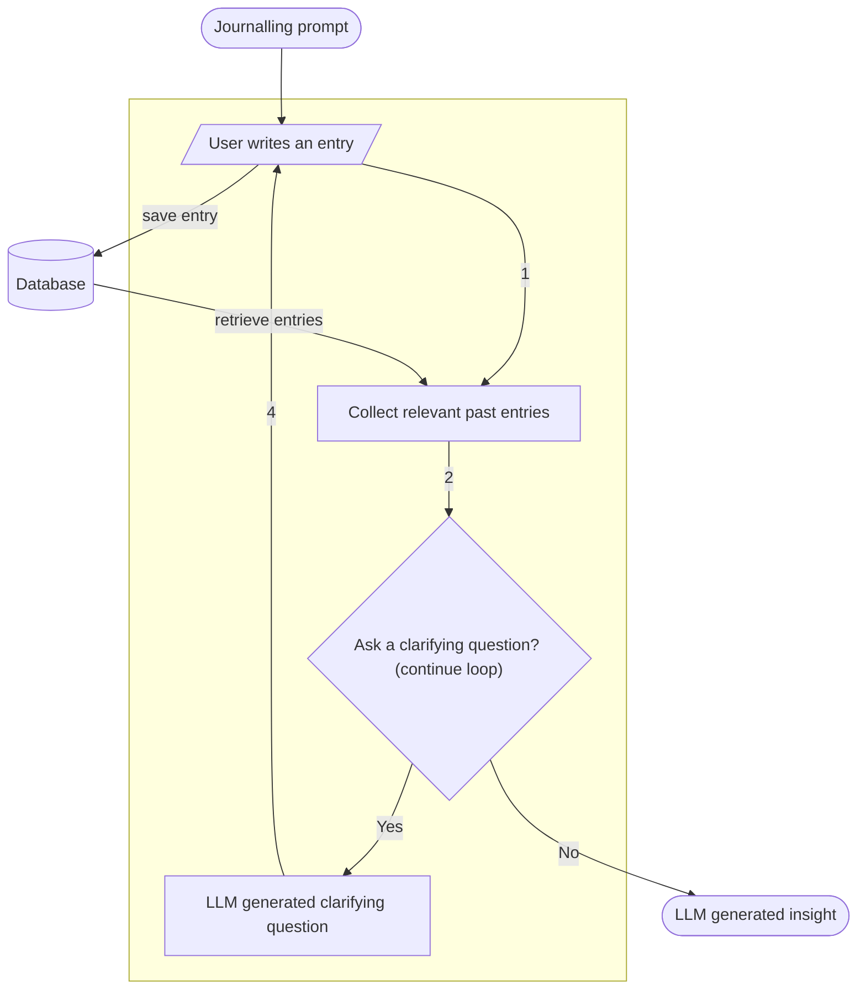
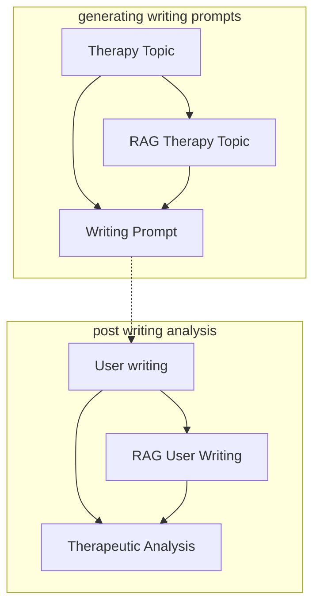

# AI Journal
An LLM powered journal to help you better understand your thoughts, and improve them over time.

## App flow

## Text Transformation Graphs

## Architecture

### Backend

FastAPI server
Ollama + llama3:7b + dspy for LLM pipelines

#### Data

Weaviate
usage +500B/user/day = +182kb / user / year (without embeddings)

### Frontend

Svelte
