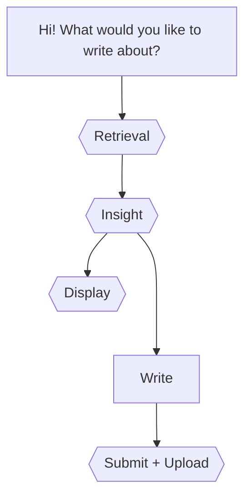

Todos:
- [x] Add a timer
- [ ] Add EmotionWheel UI selector
- [ ] Update UI styles
- [ ] Impliment weaviate datastore and tokenisation
- [ ] Impliment RAG for insights

## Architecture

### Backend
FastAPI server
Ollama + llama3:7b + dspy for LLM pipelines

#### Data 
Weaviate
usage +500B/user/day = +182kb / user / year (without embeddings)

### Frontend
Svelte