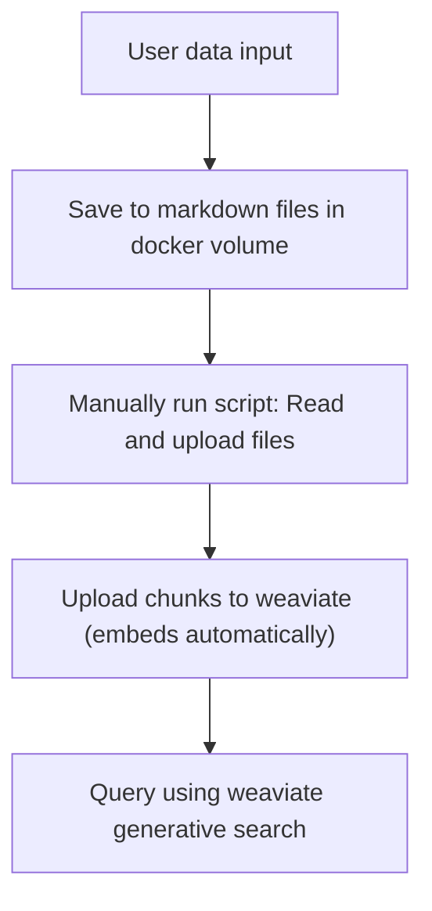

TODO: 
[] Integrate date of journal entry into RAG pipeline
[] Expand demo dataset with synthetic data
[] Extract RAG essentials into a template

```mermaid
flowchart TD
A["User data input"] --> B["Save to markdown files in docker volume"]
B --> C["Manually run script: Read and upload files"]
C --> D["Upload chunks to weaviate (embeds automatically)"]
D --> E["Query using weaviate generative search"]
```
