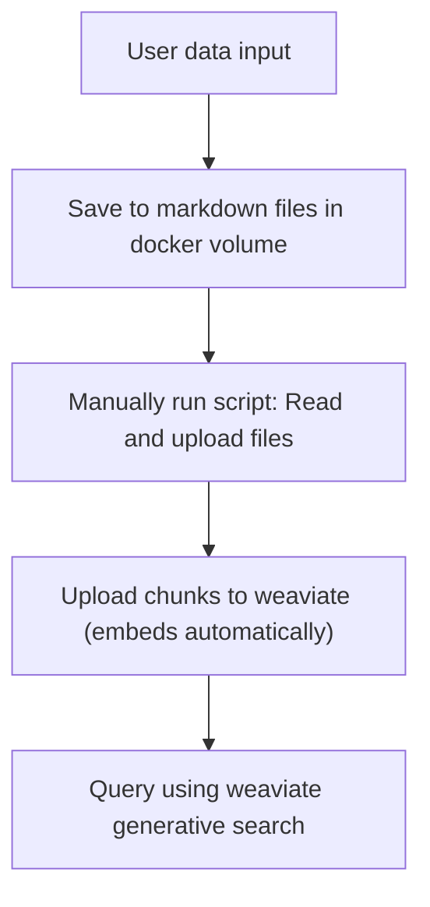

# AI Journal - Backend

## Data Flow

```mermaid
flowchart TD
A["User data input"] --> B["Save to markdown files in docker volume"]
B --> C["Manually run script: Read and upload files"]
C --> D["Upload chunks to weaviate (embeds automatically)"]
D --> E["Query using weaviate generative search"]
```
